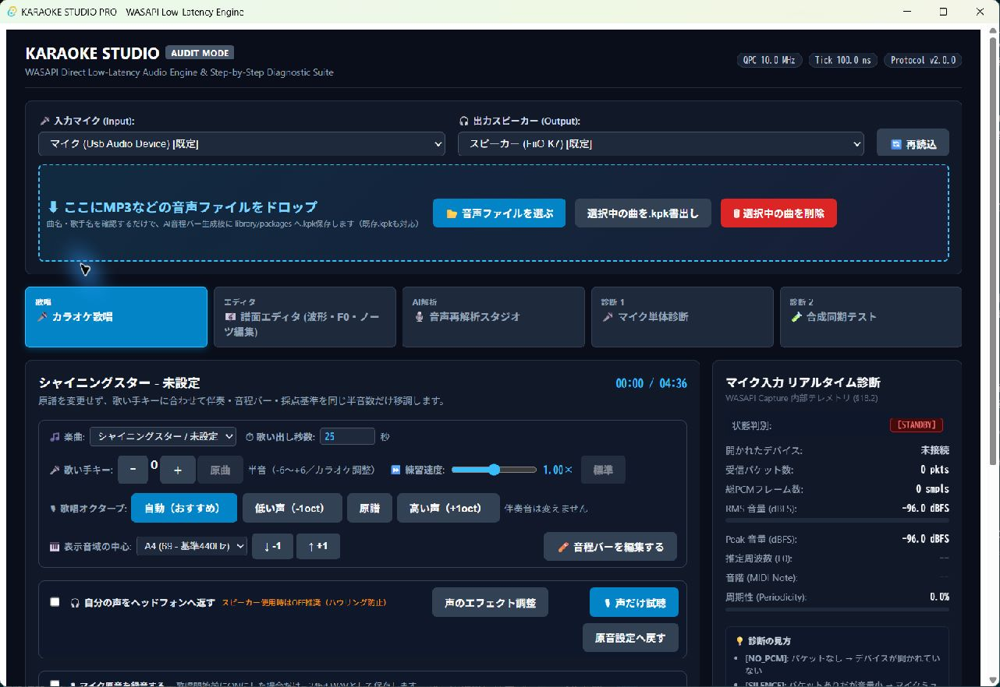
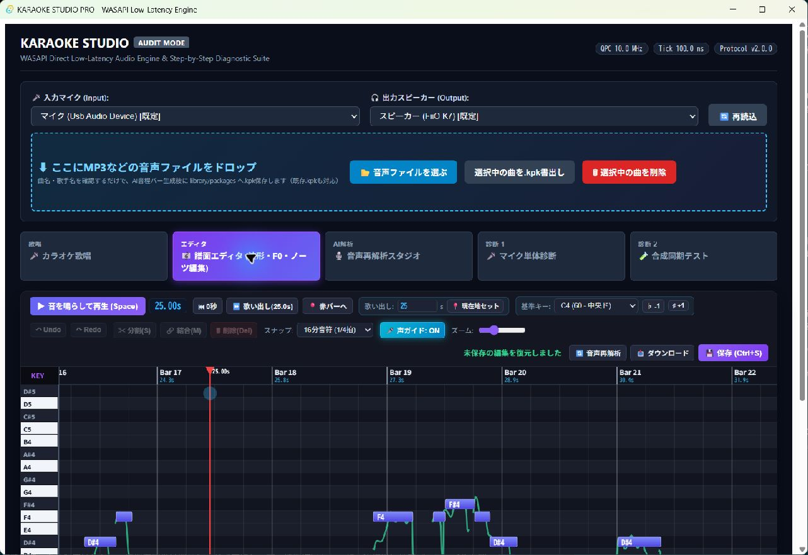

# KARAOKE STUDIO PRO

Windows上で動作する、ローカル処理中心のカラオケ練習・音程解析システムです。

音声ファイルを登録すると、ボーカル分離、歌声F0解析、音程バー生成、BPM候補生成、カラオケ用パッケージ（`.kpk`）保存までを自動で進めます。マイク入力を使ったリアルタイム音程表示、採点、キー・速度調整、マイクモニター、音声エフェクト、録音、譜面編集にも対応しています。

> [!WARNING]
> 現在は開発版です。一般利用者向けインストーラー、完全な依存関係同梱、全機材での動作保証、AI譜面の精度保証はまだありません。

## 画面例

### カラオケ歌唱



### 譜面エディター



## AIによる開発について

このリポジトリのソースコード、設計文書、テスト、UIおよび修正作業は、すべてAIとの対話によって生成・実装されています。人間のプロジェクト所有者は、要件提示、実機での歌唱確認、音質確認、機能選択を行っています。

そのため、通常の人手開発プロジェクトとは異なる不整合、未発見のバグ、説明不足、過剰実装が残っている可能性があります。コードやAI出力を無条件に正しいものとして扱わないでください。

## プライバシーとローカル処理

歌唱、マイク入力、採点、譜面編集、曲ライブラリおよび通常のAI音声解析は、ユーザーのPC内で処理する設計です。アプリから曲や録音を外部サーバーへ送信する機能や、利用状況を収集するテレメトリは実装していません。

ただし、次の操作にはインターネット接続が必要です。

- 初回開発環境構築時のRust、npm、Python依存関係の取得
- 任意のGAME ONNX解析モデルのダウンロード
- GitHubからのソース取得・更新

`library/`、`exports/`、解析モデル、録音、Python仮想環境、ビルド成果物はGit管理対象外です。

## 現在の主な機能

- WASAPIによるWindowsマイク入力・音声出力
- マイク単独診断、RMS・Peak・周期性・F0・MIDI音高表示
- リアルタイム音程軌跡と音程バー表示
- バーの存在する区間だけを対象にした採点
- 自動オクターブ補正、および低い声（-1oct）／原譜／高い声（+1oct）
- 伴奏キーの半音単位調整（-6〜+6）
- 音高を維持した練習速度変更（0.70〜1.30倍）
- マイクモニター、EQ、コンプレッサー、ノイズゲート、リミッター、リバーブ、エコー
- マイク原音録音とMIX書き出し
- MP3、OGG、WAV、FLAC、M4A、AACの曲登録
- 曲名・歌手名の登録
- Demucsによるボーカル分離
- RMVPEによるF0候補生成
- GAME ONNXモデルがある場合の音符候補生成
- 原音からの全曲BPM候補推定
- ピアノロールによる音程バー、BPM、歌詞・フレーズ編集
- `.kpk`形式の保存、読み込み、書き出し
- ライブラリからの復旧可能な曲削除

## 曲を追加する

1. アプリ上部の音声・`.kpk`読み込み領域へ、対応する音声ファイルをドロップします。
2. 曲名と歌手名を確認・入力します。
3. 登録すると、ボーカル分離とAI音程バー解析が自動で始まります。
4. 完了後、曲と譜面はローカルライブラリへ保存され、`.kpk`も生成されます。
5. AI音程バーは下書きです。実際に聴きながら譜面エディターで確認・修正してください。

AI解析では、主旋律ではなくハモリや伴奏を拾う、音符境界がずれる、BPMが半分・倍として解釈されるなどの可能性があります。

## `.kpk`で曲を配布する

「選択中の曲を`.kpk`書出し」を押すと、`exports/`へ曲パッケージが作成されます。受け取った側は`.kpk`をアプリへドロップして読み込めます。

音源の著作権や配布条件は`.kpk`を作成・配布する人が確認してください。このリポジトリは市販曲、利用許諾のない音源、ユーザーの録音を配布しません。

## ソースからビルドして起動する

対応環境は現在Windowsのみです。

1. このリポジトリを取得し、プロジェクト直下をPowerShellで開きます。
2. 正規スクリプトでWeb UIを埋め込んだリリース版を作成します。

```powershell
powershell.exe -NoProfile -ExecutionPolicy Bypass -File .\build_release.ps1
```

3. ビルド成功後、次のいずれかで起動します。

```powershell
.\run_diagnostic_ui.ps1
# または直接起動
.\target\release\appsdesktop.exe
```

`run_diagnostic_ui.ps1`は実行ファイルと埋め込み済みWeb UIを確認してから起動します。直接の`cargo build --release`では最新のWeb UIが実行ファイルへ埋め込まれない可能性があるため、使用しないでください。

開発には概ね次が必要です。

- Windows 10/11 x64
- Rust stable（MSVC toolchain）
- Node.js / npm
- Python 3.10または3.11
- Microsoft WebView2 Runtime
- Demucs、PyTorch、librosa、soundfile、scipy等の解析依存関係
- 任意：GAME 1.0.3 small ONNXモデル

解析環境の完全自動セットアップとエンドユーザー用インストーラーは未完成です。

## 開発資料

公開用の実装経過は[`docs/PROGRESS.md`](docs/PROGRESS.md)、主要な技術判断は[`docs/decisions/`](docs/decisions/)にあります。内部の計画・AI引継ぎ資料はこの公開リポジトリに含めません。

## Issueについて

バグ報告、機能提案、機材ごとの動作報告を歓迎します。ただし、個人開発かつAI主体の実験的プロジェクトであるため、回答、調査、修正、採用、リリース時期は保証できません。すべてのIssueを直せるとは限りません。

Issueには可能な範囲で、再現手順、期待した動作、実際の動作、Windows版、音声デバイス、アプリのコミットまたはハッシュを記載してください。著作権のある曲、個人の録音、メールアドレス、認証情報、トークンなどは添付しないでください。

## 現在未完成の領域

- AI音程バーの商用品質レベルの精度評価
- 部分再解析と手動編集競合の完全な保護
- 歌詞入力・ワイプの完成
- 全音声デバイスでの切断・復旧試験
- 録音／MIX／DSPの品質評価とプリセット
- 完全オフライン配布物、インストーラー、更新機構
- SBOM、全依存ライセンス監査、利用者向け文書

## ライセンス

現時点ではライセンス未決定で、Cargo設定も`Proprietary`のままです。リポジトリが閲覧可能でも、現段階では第三者へ利用・改変・再配布の権利を付与していません。

将来Public化して誰でも利用できる状態へ移行する前に、プロジェクト本体のライセンスを決定し、依存ライブラリ、解析モデル、同梱物のライセンスと整合させます。
